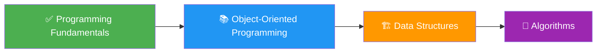

## 🧱 الأساسيات

لما نتكلم عن أساسيات المجال يمكن تقسيمها إلى 4 مواد رئيسية تُعتبر "Core" وهي:

- **Fundamentals of Programming**
- **Object-Oriented Programming (OOP)**
- **Data Structures**
- **Algorithms**

---

## 📚 مواد تانية مهمة تحت بند الأساسيات

مواد مهمة برضو محتاج تزاكرها ولكن لو كنت طالب حاسبات فغالبًا هتكون بتدرسها بالفعل في الكلية، وبالتالي:
- تم ذكر المواد دي في فيديو الدكتور مصطفى سعد [خارطة طريق مبسطة](https://www.youtube.com/watch?v=b56XFMNEzAs&list=PLPt2dINI2MIYY3yqu4YDu2se2GCpcKBfB&index=4)

---

## 🧭 الرودماب

الرودماب دي مليانة مصادر للشرح والحل، وكافية جدًا إنك بعد ما تخلصها يكون عندك **أساس قوي جدًا** تقدر تكمل بيه في المرحلة اللي بعدها، وهي OOP.

### 🎯 إرشادات عامة:

 وانت ماشي في كل Topic هتلاقي أكتر من مصدر للشرح. اسمعهم كلهم لو عندك وقت كتر التعرض للمحتوى العلمي في المرحلة دي مفيد جدًا كل فيديو هتتعلم منه حاجة جديدة كل ما تعيد سماع الفيديو هتكتشف نقاط جديدة لا تختصر وقت في المرحلة دي، **خليها أولوية** في دراستك.

 لو مفهمتش فيديو اسمعه مرة واتنين وتلاتة لو لسه مش واضح، شوف شرح من مصدر تاني ممكن تحس إنك ضعيف في Topic معين، ده عادي، **كتر الحل عليه هيقويك** في فيديوهات الـ Practice بيتم عرض المسألة وبعدها الحل **متسمعش الحل على طول!** وقف الفيديو وجرب تحل بعد كده اسمع الحل وقارن طول ما انت بتفكر، طول ما انت بتتعلم وبتطور من نفسك.

---
## 🏋️‍♂️ الـ Homework

في البداية هتلاقي مسارين للحل، اختار واحد بس وامشي عليه:

### 1. مسار شيتات أسيوط على موقع Codeforces

- مناسب لو حبيت **ستايل موقع Codeforces**.
- تقدر تعمل حساب على Codeforces من الفيديو ده:  
  [How to create a Codeforces account](https://www.youtube.com/watch?v=WIvV_HoOruE&list=PLkay_Ly8rNnaAIxbyAtCWai2D7wRB5eZ1)

### 2. مسار مسائل دكتور مصطفى سعد

- ده المسار المحبب لي شخصيًا.
- دكتور مصطفى عامل مجهود كبير جدًا في تنظيم وتدرج المسائل.
- مقسم المسائل إلى مستويات: (**Easy** - **Medium**  - **Hard**)

## 📋 Table of Contents

- 🎯 Course Overview
- 📚 Prerequisites & Learning Strategy
- 🛣️ Learning Path
- 📖 Detailed Curriculum
- 🎓 Next Steps

---

**Core Subjects:**

1. **Fundamental of Programming** 🔹
2. **Object-Oriented Programming (OOP)** 🔸
3. **Data Structures** 🔹
4. **Algorithms** 🔸

### 🎯 Target Audiences

|Audience|Recommended Video|
|---|---|
|🎓 **Computer Science Students**|[CS Student Roadmap](https://www.youtube.com/watch?v=b56XFMNEzAs&list=PLPt2dINI2MIYY3yqu4YDu2se2GCpcKBfB&index=4)|
|👨‍💻 **Non-CS Background**|[General Roadmap](https://www.youtube.com/watch?v=JkcmNrdhjMs&list=PLPt2dINI2MIYY3yqu4YDu2se2GCpcKBfB&index=9)|

---

## 📚 Prerequisites & Learning Strategy

### 🎬 Essential Preparation Videos

- 🎥 [إلى طلابنا فى حاسبات و معلومات - نصائح لمستقبل أفضل](https://www.youtube.com/watch?v=-ON5YZySTUI&list=PLPt2dINI2MIYY3yqu4YDu2se2GCpcKBfB&index=3)
- 🎥 [الى طلابنا فى حاسبات و معلومات - سنة أولى و تانية](https://www.youtube.com/watch?v=njGvWw6fSdY&list=PLPt2dINI2MIYY3yqu4YDu2se2GCpcKBfB&index=5)

### 💡 Learning Tips

> **🔥 Pro Tips for Success:**
> 
> - 📺 **Watch Multiple Sources**: Don't rely on just one explanation
> - 🔄 **Repeat & Review**: Watch videos 2-3 times for better understanding
> - ⏸️ **Practice First**: Pause before solutions and try solving yourself
> - 🧠 **Think While Learning**: Active thinking = Active learning
> - ⏰ **Don't Rush**: This foundation phase is crucial - invest time here

### 🛤️ Homework Track Selection

Choose **ONE** track and stick with it:

#### Track 1: 🏆 Codeforces (Assiut Sheets)

- **Platform**: Codeforces
- **Style**: Competitive Programming Format
- **Setup**: [Create Codeforces Account](https://www.youtube.com/watch?v=WIvV_HoOruE&list=PLkay_Ly8rNnaAIxbyAtCWai2D7wRB5eZ1)

#### Track 2: 📚 Dr. Mostafa Saad (Recommended)

- **Difficulty Levels**: Easy → Medium → Hard
- **Structure**: Progressive problem difficulty
- **Advantage**: Well-structured learning curve

### 📝 Solution Resources

- 💾 **Dr. Mostafa Saad Solutions**: [GitHub Repository](https://github.com/mostafa-saad/ArabicCompetitiveProgramming/tree/master/18-Programming-4kids)
- 🎥 **Assiut Sheets Solutions**: [Video Playlist](https://www.youtube.com/watch?v=rArqYPpuj3E&list=PLq8huKQsVgUMchGBuUPjQlcv7KxLIoGXj&index=8)

---

## 📖 Detailed Curriculum

### 1.1 🌟 Introduction to Programming

**📚 Learning Resources:**

- 🎥 [Intro to Programming](https://youtu.be/2ak8Kca69BE?si=n0x7wrsIcSkjsQS6)
- 🎥 [Problem Solving Fundamentals](https://youtu.be/bIvvEgDg0GM?si=u1prOQhgNSZnUxLD)
- 🎥 [Competitive Programming Overview](https://youtu.be/S0TO8AvfQ70?si=63Cr3jVSQKVXxzKX)
- 🎥 [Dr. Mostafa Saad - Programming Intro](https://youtu.be/YS1v0-wifg8?si=Agwfe-_HlHybBqIl)
- 🎥 [Compilers and IDEs](https://youtu.be/USt9NVsZryc?si=Gs7PJc_EeZVWvaU2)
- 🛠️ [Install Code Blocks](https://youtu.be/JuQvdv3eiMw?si=1ComurpdCpn5_B5F)

---

### 1.2 🖨️ Printing

**📚 Learning Resources:**

- 🎥 [Basic Printing](https://youtu.be/vN3wEox3UH4?si=_DD__27awgIROemo)
- 🎥 [Dr. Mostafa Saad - Printing](https://youtu.be/EN1kX4HIPgs?si=d1zJZ1KEdgYD30p9)
- 🎥 [Elzero - Printing Basics](https://youtu.be/6UoFcvARKI4?si=Ro656zdE3sEd3v9W)

**📝 Homework (Track 2):**

- 📋 [Printing Homework](https://youtu.be/EN1kX4HIPgs?si=gtmf8wJ_Gu8lRycN&t=891)

---

### 1.3 📊 Data Types and Variables

**📚 Learning Resources:**

- 🎥 [Data Types Fundamentals](https://youtu.be/mo6zUZZShTA?si=c50fejcA_MXyMlS2)
- 🎥 [Data Types Part 2](https://youtu.be/aak1z7syTsQ?si=pNEU0NdUdsUdLDTs)
- 🎥 [Char and Bool Types](https://youtu.be/QGqZlbdWSv8?si=mUdziN-reJoQCuoy)
- 🎥 [Dr. Mostafa - Data Types](https://youtu.be/ncwIeshX7Kk?si=isxhC6OgaKb9rZLM)
- 🎥 [Input and Output](https://youtu.be/93uTUtknYkE?si=UoNHhW386FEeG33v)
- 🎥 [Variables Basic Knowledge](https://www.youtube.com/watch?v=R2zqj_52WwU)
- 🎥 [Variable Naming Best Practices](https://www.youtube.com/watch?v=A6B4tlaPapo)
- 📱 [Age Calculator App](https://www.youtube.com/watch?v=cS0tbixHmdI)

**📝 Homework (Track 2):**

- 📋 [Data Types Homework](https://youtu.be/ncwIeshX7Kk?si=ZI_P08TOnzA8yblt&t=1477)

---

### 1.4 🔣 Logical Operators

**📚 Learning Resources:**

- 🎥 [Logical Operators Basics](https://www.youtube.com/watch?si=VjJ30hJLgMWIAlLn&v=2pA6e25BJpQ&feature=youtu.be)
- 🎥 [Comparison Operators](https://www.youtube.com/watch?v=xpznDlbgQPM)
- 🎥 [Dr. Mostafa - Logical Operators](https://www.youtube.com/watch?v=qmHE9QISuVQ)

**📝 Homework (Track 2):**

- 📋 [Logical Operators Homework](https://youtu.be/qmHE9QISuVQ?si=zZGaCiGElJdgYSXZ&t=1509)

---

### 1.5 ➗ Division and Modulus

**📚 Learning Resources:**

- 🎥 [Arithmetic Operators](https://www.youtube.com/watch?v=m84cz1kwJaA)
- 🎥 [Increment/Decrement](https://www.youtube.com/watch?v=S37s4hbeIS4)
- 🎥 [Assignment Operators](https://www.youtube.com/watch?v=nCO0KZ67b1Q)
- 🎥 [Operator Precedence](https://www.youtube.com/watch?v=e0Gz1_ceuMU)
- 🎥 [Division and Modulus Deep Dive](https://www.youtube.com/watch?v=jJVaDl_dePk)

**📝 Homework:**

- 📋 [Division & Modulus Tasks](https://youtu.be/jJVaDl_dePk?si=r7YtuCKlCKKt0snC&t=1087)

---

### 1.6 🎯 Selection (Conditions)

**📚 Learning Resources:**

- 🎥 [If Conditions Part 1](https://www.youtube.com/watch?v=7RdjR3PyrGk)
- 🎥 [If Conditions Part 2](https://www.youtube.com/watch?v=OKDtXbT7Jcs)
- 🎥 [Dr. Mostafa - Selection](https://www.youtube.com/watch?v=xmjB7u7mHWE)
- 🎥 [Nested Conditions](https://www.youtube.com/watch?v=Ps0xSAXmULA)
- 🎥 [Switch Case Statements](https://www.youtube.com/watch?v=OK1uu-axN0E)
- 🎥 [Ternary Operators](https://www.youtube.com/watch?v=Ang11UuVE30)

**📝 Practice:**

- 🏆 **Track 1**: [Codeforces Sheet #1](https://codeforces.com/group/MWSDmqGsZm/contest/219158)
- 📚 **Track 2**: [Selection Homework](https://youtu.be/xmjB7u7mHWE?si=WN4v8U1aYLeTuS9_&t=1417)

---

### 1.7 🔄 Loops

**📚 Learning Resources:**

- 🎥 [Loop Sessions 1-7 (SVU)](https://www.youtube.com/watch?v=ww5f1U-7pnI) _[Complete Series]_
- 🎥 [While Loops Introduction](https://www.youtube.com/watch?v=qVBi98-XJ3s)
- 🎥 [While Loops Practice](https://www.youtube.com/watch?v=yjzB3-CxWmE)
- 🎥 [For Loops Introduction](https://www.youtube.com/watch?v=LsBZvL4-KuE)
- 🎥 [For Loops Practice](https://www.youtube.com/watch?v=_kjcb7w220c)

**📝 Practice:**

- 🏆 **Track 1**: [Codeforces Sheet #2](https://codeforces.com/group/MWSDmqGsZm/contest/219432)
- 📚 **Track 2**:
    - [While Loops Homework](https://www.youtube.com/watch?v=yLNNnX59jO8&list=PLPt2dINI2MIbwnEoeHZnUHeUHjTd8x4F3&index=13)
    - [For Loops Homework](https://www.youtube.com/watch?v=mNotKsNLyxo&list=PLPt2dINI2MIbwnEoeHZnUHeUHjTd8x4F3&index=16)

---

### 1.8 📊 Arrays

**📚 Learning Resources:**

- 🎥 [Array Sessions 1-8 (SVU)](https://www.youtube.com/watch?v=8V8HfgVVPbY) _[Complete Series]_
- 🎥 [1D Arrays Introduction](https://www.youtube.com/watch?v=0HT2-2qD654)
- 🎥 [1D Arrays Practice](https://www.youtube.com/watch?v=38l7MZbUZdM)
- 🎥 [Character Arrays](https://www.youtube.com/watch?v=GoqfS1m1BYo)
- 🎥 [2D Arrays Introduction](https://www.youtube.com/watch?v=-GxY9NCG9Bw)
- 🎥 [2D Arrays Practice](https://www.youtube.com/watch?v=rUDC13pfB5E)

**📝 Practice:**

- 🏆 **Track 1**: [Codeforces Sheet #3](https://codeforces.com/group/MWSDmqGsZm/contest/219774)
- 📚 **Track 2**:
    - [1D Arrays Homework](https://www.youtube.com/watch?v=205MJC3klII&list=PLPt2dINI2MIbwnEoeHZnUHeUHjTd8x4F3&index=19)
    - [Char Arrays Homework](https://www.youtube.com/watch?v=ZKE4VZHS9IY&list=PLPt2dINI2MIbwnEoeHZnUHeUHjTd8x4F3&index=22)
    - [2D Arrays Homework](https://www.youtube.com/watch?v=GUJlDqIMFVA&list=PLPt2dINI2MIbwnEoeHZnUHeUHjTd8x4F3&index=25)

---

### 1.9 ⚙️ Functions

**📚 Learning Resources:**

- 🎥 [Functions Introduction](https://www.youtube.com/watch?v=z61hvizsrZs)
- 🎥 [Functions Practice](https://www.youtube.com/watch?v=ksh0QLTaWt0)
- 🎥 [Advanced Functions (3-part series)](https://www.youtube.com/watch?v=6m-RTOsvp7E)

**📝 Practice:**

- 🏆 **Track 1**: [Codeforces Sheet #5](https://codeforces.com/group/MWSDmqGsZm/contest/223205)
- 📚 **Track 2**: [Functions Homework](https://www.youtube.com/watch?v=Lu3z4rfU-2s&list=PLPt2dINI2MIbwnEoeHZnUHeUHjTd8x4F3&index=28)

---

### 1.10 🔄 Recursion

**📚 Learning Resources:**

- 🎥 [Recursion Introduction](https://www.youtube.com/watch?si=f3jdBjCOXK07ath1&v=ZlyYQqYj2W8&feature=youtu.be)
- 🎥 [Recursion Deep Dive (4-part series)](https://www.youtube.com/watch?v=t0cHKEof1S8)
- 📚 [Complete Recursion Playlist](https://www.youtube.com/watch?v=HoIYCoa06hs&list=PLhgRx-N_jLx2Fwk2LcKL1P8eV42N_RCEE)

**📝 Practice:**

- 🏆 **Track 1**:
    - [Codeforces Sheet #7](https://codeforces.com/group/MWSDmqGsZm/contest/223339)
    - [Video Solutions](https://www.youtube.com/watch?v=jAobHD1YaJo&list=PLhgRx-N_jLx0eE2sm3xs3BouPG06RR97t)
- 📚 **Track 2**: [Recursion Homework](https://www.youtube.com/watch?v=OUxtZa4jyq4&list=PLPt2dINI2MIbwnEoeHZnUHeUHjTd8x4F3&index=33)

---

### 1.11 🏗️ Structures (Struct)

**📚 Learning Resources:**

- 🎥 [Structures Introduction](https://www.youtube.com/watch?si=7nZ2JWYvqKNbIZdn&v=ZdULFEUxL6w&feature=youtu.be)
- 🎥 [Structures Practice](https://www.youtube.com/watch?v=nF_26HU6ekQ)

**📝 Practice:**

- 📋 [Structures Homework](https://www.youtube.com/watch?v=zzuhhAuW5FY&list=PLPt2dINI2MIbwnEoeHZnUHeUHjTd8x4F3&index=31)

---

### 1.12 📚 STL (Standard Template Library)

**📚 Learning Resources:**

- 🎥 [STL Introduction (3-part series)](https://www.youtube.com/watch?v=ypxNh-pTqOo)
- 📚 [Complete STL Playlist](https://www.youtube.com/playlist?list=PLCInYL3l2AainAE4Xq2kdNGDfG0bys2xp)
- 🎥 [Advanced STL (4-part series)](https://www.youtube.com/watch?v=Uh2hnrjO26o)

**📝 Practice:**

- 🏆 **Track 1**:
    - [STL Practice #2](https://codeforces.com/group/3nQaj5GMG5/contest/373244)
    - [STL Practice #3](https://codeforces.com/group/3nQaj5GMG5/contest/374321)
- 📚 **Track 2**: [STL Homework](https://www.youtube.com/watch?v=POpxu3kUT6M&list=PLPt2dINI2MIbwnEoeHZnUHeUHjTd8x4F3&index=37)

---

### 1.13 🎯 Pointers

**📚 Learning Resources:**

- 🎥 [Pointers in C++](https://www.youtube.com/watch?v=38IG-UToeZ0)
- 📚 [Complete Pointers Playlist](https://www.youtube.com/playlist?list=PLwCMLs3sjOY6z3264DylWHcHBtmEjUWrA)
- 🎥 [Pointers Introduction](https://www.youtube.com/watch?v=h-HBipu_1P0&list=PL2_aWCzGMAwLZp6LMUKI3cc7pgGsasm2_)

---

### 1.14 🐛 Debugging

**📚 Learning Resources:**

- 🎥 [Debug in CLion](https://www.youtube.com/watch?v=q8YQi6YXQj8)
- 🎥 [Debug in Code Blocks](https://www.youtube.com/watch?v=XNdATcXPm-w&t=39s)
- 🎥 [C++ Debugging Basics](https://www.youtube.com/watch?v=k42SbQIZYuU)

---

## 🎓 Next Steps

### 🗺️ Continue Your Journey

After completing this roadmap, you'll be ready for:

---
# 🚀 Programming Fundamentals Roadmap

> **"علمكم الله ما ينفعكم ونفعكم بما تعلمتم وزادكم علما"**  
> — دكتور مصطفي سعد جزاه الله خيرا

---

🎥 **Next Roadmap Preview**: [Your Next Steps](https://www.youtube.com/watch?v=YPKfSyOQxmI&list=PLPt2dINI2MIbwnEoeHZnUHeUHjTd8x4F3&index=41&t=47s)

### 📖 Additional Resources

> 🌟 **Find More Roadmaps**: Check out the complete CS roadmap collection on [GitHub](https://github.com/Ahmedhany-1/CS---Roadmap/tree/main)

---

